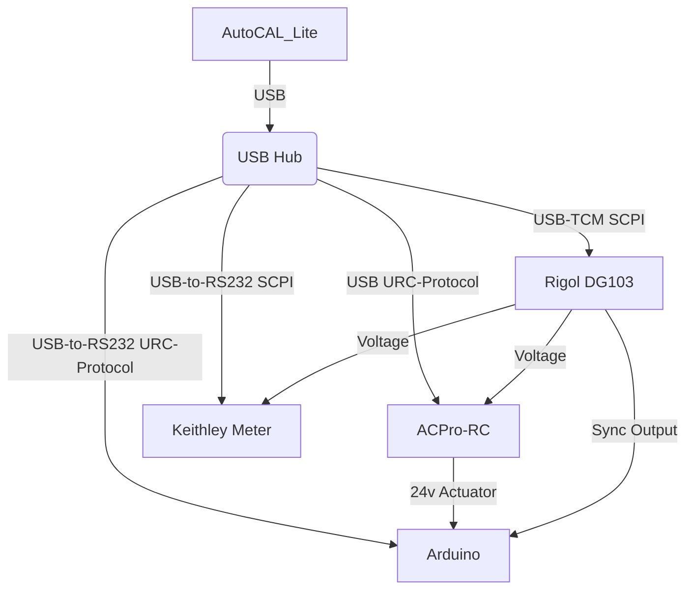

# ACPro-RC Test Cart Diagram

* AutoCAL_Lite interfaces to: `Trip Unit`, `Arduino`, `Rigol`, and `Keithley Multimeter`

* Arduino is used to time trips (delta from sync Rigol sync pulse to Trip Unit Actuator)

# AUTOCAL_LITE STATUS

* Automated and manual calibration routines finalized and stable

* Long Time Trip testing works well
* Short Time Trip testing works well
* Instantanious Trip testing works well
* Ground Fault Trips in progress...

# HARDWARE TODO

* Design circuit to programatically control which phases are enabled to R.C. 

